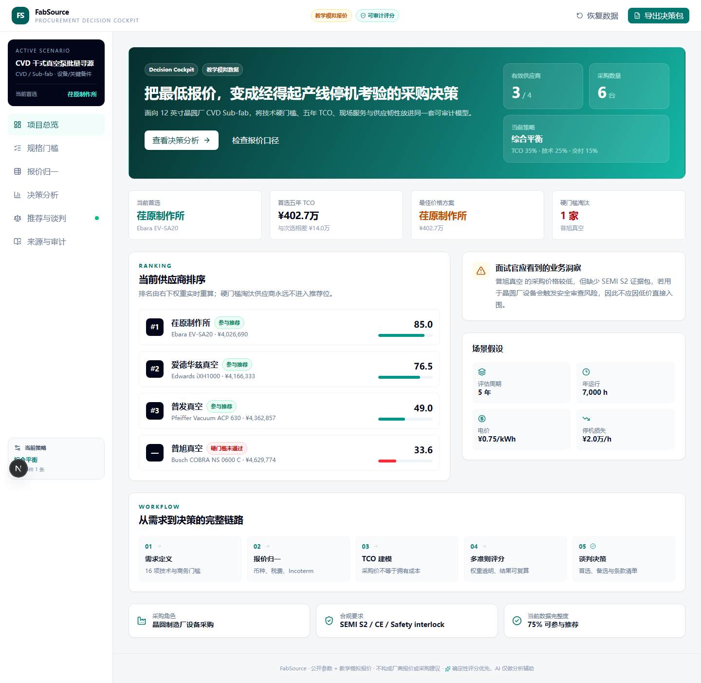

# FabSource 晶圆厂干式真空泵寻源比选工作台

在线演示（国内网络优先）：https://abu-abu-tang.github.io/fabsource/

备用地址（Vercel）：https://fabsource.vercel.app



FabSource 是一个面向**晶圆制造厂设备/关键备件采购**的可解释决策 Demo。它以 CVD Sub-fab 使用 6 台干式真空泵为场景，将技术硬门槛、五年 TCO、交付服务、可靠性、供应风险和数据来源放进同一套可复算模型。

项目的重点不是“做一个漂亮看板”，而是回答设备采购中的真实问题：**为什么最低报价不一定是最佳方案，以及采购人员如何让决策经得起产线停机、合规审查和技术复核。**

## 核心能力

- 16 项技术要求，明确区分硬门槛与加权项。
- 4 家真实品牌的公开参数与教学模拟报价。
- 币种、汇率、税费、Incoterm 和商务费用归一。
- 五年 TCO：采购、物流关税、安装、能耗、维护备件、服务合同、停机损失和残值。
- 五维权重与四套策略：综合平衡、成本优先、停机优先、本地化/韧性。
- 权重变化实时重排，所有得分保留计算轨迹。
- XLSX / CSV 报价导入、模板下载和 XLSX 决策包导出。
- 可选 BYOK AI 摘要；无 Key 时使用确定性规则摘要，主流程不受影响。
- 中文业务界面，技术参数、认证和标准保留英文。

## 快速开始

```bash
npm install
npm run dev
```

打开 [http://localhost:3000](http://localhost:3000)。

## 验证

```bash
npm run lint
npm run typecheck
npm test
npm run test:e2e
npm run build
```

首次运行端到端测试前执行：

```bash
npx playwright install chromium
```

## 决策逻辑

默认场景为采购 6 台设备、评估 5 年、年运行 7,000 小时、电价 0.75 元/kWh、停机损失 20,000 元/小时。所有值均可在界面调整。

```text
五年 TCO = 采购价 + 运费/关税 + 安装调试 + 能耗 + 维护备件
         + 服务合同 + 停机损失 - 残值
```

默认权重为 TCO 35%、技术 25%、交付服务 15%、质量可靠性 15%、供应风险 10%。详细公式见 [SCORING.md](docs/SCORING.md)。

## 数据声明

- 品牌和产品族来自公开产品资料，演示参数为跨页面归纳值。
- 报价、故障率、停机损失、服务费用和部分参数均为**教学模拟数据**。
- 本项目不代表任何厂商的真实报价、性能承诺或采购建议。
- 公开 Demo 运行时不抓取供应商网页；导入数据仅保存在当前浏览器。

## 技术栈

Next.js 16 · TypeScript · Tailwind CSS 4 · Recharts · Zustand · ExcelJS · Zod · Vitest · Playwright

## 文档

- [架构说明](docs/ARCHITECTURE.md)
- [评分公式](docs/SCORING.md)
- [数据字典](docs/DATA_DICTIONARY.md)
- [5 分钟演示脚本](docs/DEMO_SCRIPT.md)
- [新手教程](docs/NEW_USER_GUIDE_CN.md)
- [通用采购平台路线图](docs/PRODUCT_ROADMAP_CN.md)
- [面试追问准备](docs/INTERVIEW_QA.md)
- [简历描述](docs/RESUME_BULLETS.md)

## 部署

仓库可直接导入 Vercel 部署。应用主体为静态/客户端工作区，可选 AI 通过 Next.js Route Handler 转发到用户配置的 OpenAI 兼容服务；不需要数据库或服务端持久化。


