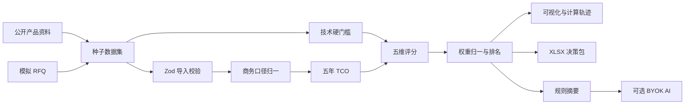

# 架构说明

## 分层

- `src/data`：版本化种子数据，包含供应商、型号、规格、报价、来源和评分预设。
- `src/lib/calculations.ts`：无 UI 依赖的 TCO、技术门槛、标准化、评分和排名函数。
- `src/lib/validation.ts`：导入行与 AI 请求的 Zod 校验。
- `src/lib/excel.ts`：报价模板、CSV/XLSX 解析、决策包导出。
- `src/lib/store.ts`：Zustand 工作区状态与 `localStorage` 持久化。
- `src/components`：总览、规格、报价、决策、推荐、来源六个业务工作区。
- `src/app/api/ai/analyze`：可选 AI 的服务端转发，不持久化 Key。

## 数据流

1. 种子数据或用户导入报价进入统一 `FabSourceDataset`。
2. 报价先按税率与汇率转为 CNY，再计算五年 TCO。
3. 技术参数独立执行硬门槛判断；失败供应商标记为 `disqualified`。
4. 有效供应商参与 TCO 逆向标准化，并得到技术、交付、质量、风险分项分。
5. 权重归一化后合成总分，有效供应商重新排名。
6. UI、规则摘要和 XLSX 全部读取同一份 `ScoreResult[]`，避免展示层另算一套逻辑。
7. AI 仅接收排名摘要，用于生成文字分析，不参与评分。

## 状态与安全

- 无登录、无数据库、无服务端业务持久化。
- 用户修改存放在浏览器 `localStorage`。
- AI Key 仅放在 `sessionStorage`，随请求临时转发，不写日志或磁盘。
- Demo 不使用实时汇率和供应商爬虫，保证可复现与合规。
